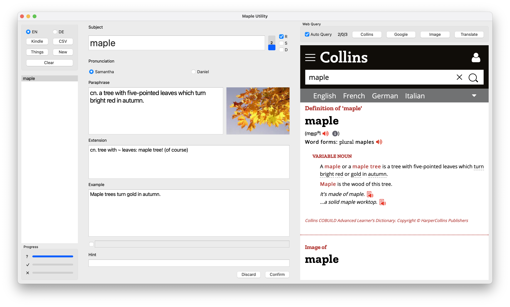
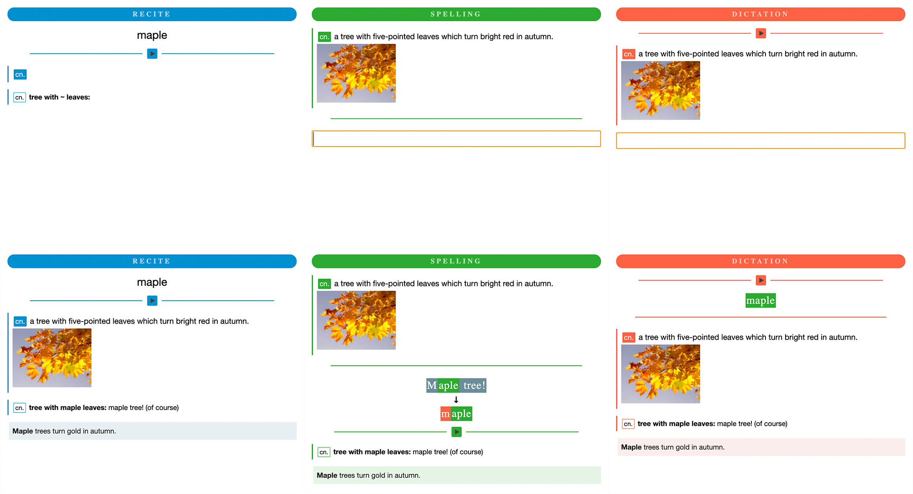

Maple Anki Utility for Vocabulary Learners
==========================================

There are a handful of ways to make Anki flashcards: getting a shared deck, batch processing a list, or using awesome
add-ons like [AnkiConnect](https://ankiweb.net/shared/info/2055492159) to create cards from external applications.

But I find making my own cards manually works best for me. It is not a waste of time, but already a part of the
learning process.

However, manually making cards is still time-consuming. Therefore, I made
the [Maple Anki Template](https://github.com/liuzikai/Maple-Anki-Template) and this utility to automate a bunch of work.

Here are some highlights:
* Import from Kindle Vocabulary Builder, CSV, Thing 3 List, or manually create new cards.
* Built-in audio generator using macOS's native text-to-speech.
* Side-by-side web browser to automatically query web directory, image search, and translation, with auto prefetching.
* Combined with [Maple Anki Template](https://github.com/liuzikai/Maple-Anki-Template), providing auto parts of speech (POS) highlighting, auto keyword highlight, etc.

## Getting Started
**This application only supports macOS for now** (it uses macOS built-in features such as text-to-speech and AppleScript).
The main part of it is in PyQt6 and should be portable. Contributions are welcomed!

Download the pre-built application in the release page.

=> [User Manual](resource/user-manual.md). You may want to at least get familiar basic workflow of the tool.

If you want to run the tool manually in Python, download the repo and run `pip3 install -r requirements.txt`.
In addition, you will need the following tools:
* `lame` (run `brew install lame`, used for converting audio files)
* `tar` (macOS built-in, used by data_source to backup file)
* `say` (macOS built-in, used for pronunciation)
* `osascript` (macOS built-in, used to connect Things 3)

## License
The code is released under the MIT License.

The icon uses Maple by Adrien Coquet from [Noun Project](https://thenounproject.com/browse/icons/term/maple/) (CCBY3.0).
