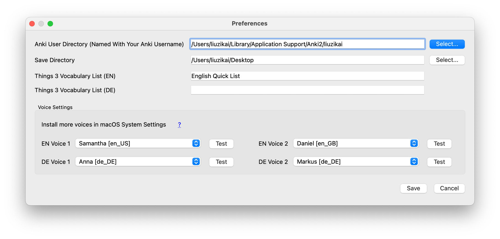

Maple Anki Utility User Manual
==============================

<!-- TOC -->
* [Overview](#overview)
* [Initial Setup (Preferences)](#initial-setup--preferences-)
  * [Add Voices](#add-voices)
* [Data Sources and Vocabulary List](#data-sources-and-vocabulary-list)
  * [Kindle Vocabulary Builder](#kindle-vocabulary-builder)
  * [CSV](#csv)
  * [Things 3 List](#things-3-list)
  * [Create a Single Entry Manually](#create-a-single-entry-manually)
    * [Smart Duplication](#smart-duplication)
  * [Navigate in the Vocabulary List](#navigate-in-the-vocabulary-list)
  * [Learning Progress Indicators](#learning-progress-indicators)
* [Card Editor](#card-editor)
  * [Subject and Card Type Selectors](#subject-and-card-type-selectors)
  * [Pronunciation](#pronunciation)
  * [Paraphrase](#paraphrase)
    * [Add an Image](#add-an-image)
  * [Extension](#extension)
  * [Example](#example)
  * [Hint](#hint)
  * [Text Formatting](#text-formatting)
  * [Confirm and Discard](#confirm-and-discard)
* [Web Query](#web-query)
  * [Collins Web Directory](#collins-web-directory)
  * [Google](#google)
  * [Google Images](#google-images)
  * [Google Translate](#google-translate)
  * [Navigate Forward and Back](#navigate-forward-and-back)
* [Import to Anki](#import-to-anki)
* [Miscellaneous](#miscellaneous)
  * [Path of the Configuration File](#path-of-the-configuration-file)
  * [Backup of Kindle and CSV Database](#backup-of-kindle-and-csv-database)
<!-- TOC -->

# Overview

Maple Utility is designed as a standalone program.
It is designed to generate cards in the [Maple Anki Template](https://github.com/liuzikai/Maple-Anki-Template) only (be
sure to visit the link first).
It generates a txt file that contains the cards to be batch imported to Anki.

> Why not make it an Anki add-on? Currently, there is no plan for that, as the utility consists of many parts.
> For example, it uses [QWebKitView](https://github.com/liuzikai/pyqt-macos-native-webview), wrapping macOS native
> WKWebView in PyQt. Building it as an Anki add-on may not bring many benefits but can introduce a lot of difficulties
> to test and debug.

The general workflow is:

* Import the vocabulary from one of the data sources: Kindle Vocabulary Builder (`Kindle`), CSV file (`CSV`), Things 3
  list (`Things`), or create a single entry manually (`New`).
* Choose a word on the left side to edit its card. All automations built in
  the [Maple Anki Template](https://github.com/liuzikai/Maple-Anki-Template) work after importing to Anki.
  For example, `cn.` in the `Paraphrase` section will be highlighted as a part of speech (POS).
* The word is automatically looked up on the Collins Directory on the right side (if `Auto Query` is checked).
  To search the word on a different website, use the buttons on the top right.
* Click `Confirm` to save the card. Click `Discard` to discard a word.
* Close the program at any time. Confirmed cards are saved to a txt file in the save directory
  you [configure](#initial-setup--preferences-)
  Confirmed or Discarded words will not appear when you load the same data source next time. The other words remain.
* Import the generated txt file into Anki, following [these instructions](#import-to-anki).

Hover over UI components to see Tips.

# Initial Setup (Preferences)

The first time the program start, you will be asked to do some initial settings. You can always re-open the Preferences
in the menu bar.

* Anki User Directory: select your user directory (named with your Anki username). This is necessary to put generate
  audio files in the correct place.
* Save Directory: path to output the generated cards.
* Things 3 Vocabulary List (EN/DE): Things 3 projects as data sources for English/German learning modes.
* Voice Settings: choose the voice to generate pronunciation audio.

## Add Voices

Maple Utility uses macOS built-in text-to-speech to generate pronunciation audio.
You can choose from the installed voices.
To install more voices, open `System Settings - Accessibility - Spoken Content - System voice - Manage Voices...`
(new settings of macOS 13).

# Data Sources and Vocabulary List

Maple Utility supports multiple data sources. The idea is to process the list of vocabulary.
Words can be confirmed or discarded, and marked as completed in the data source so that they won't appear the next time
loading the same data source.
The other words remain unchanged.

## Kindle Vocabulary Builder

Connect Kindle to the Mac. Import the list using the `Kindle` button.

Kindle Vocabulary Builder records the example sentence and the citation, which will be imported into the citation
textbox (at the bottom of `Example`).

## CSV

A CSV (comma-separated values) file can be used as a data source.
The CSV should have at least 5 columns: subject, usage, title, authors, and category.
The additional columns are ignored.
The first line of the file is regarded as the heading and gets discarded.

=> [Example CSV File](csv-example.csv)

## Things 3 List

Why have such a data source? I often find unknown words from different places, like websites.
And Things 3 is my tool to quickly capture todos.
Therefore, I create a list in Things to store those words captured from everywhere.

All todos in the configured Things list (in [Preferences](#initial-setup--preferences-)) are treated as words.
The caption is treated as the subject and the note as example.

When a word is confirmed or discarded, the corresponding todo is moved to the Trash in Things.

## Create a Single Entry Manually

As the name suggests, create a single entry manually by clicking `New` (`Cmd + N`).
This button is still available when a Kindle/CSV/Things data source is loaded, and the created entry is **not** written
back to the source.
Manually created entries **will** disappear on `Clear` or loading another data source.

### Smart Duplication

Sometimes, you write an example sentence in `Example` and find there is another word inside that you want to learn.
In this case, select the word and use Smart Duplicate (`Cmd + Shift + N`).
It will create a new manual card, using the selected text as the new subject, while
keeping the Example.

## Navigate in the Vocabulary List

Select an entry in the list on the left to navigate. Contents in the card editor are saved temporarily when switching
word, but will lose when the program restarts (confirmed entries are written to the output file though, of course).

## Learning Progress Indicators

At the bottom left. Hover to see the counts.

# Card Editor

Fields generally map one-to-one to fields in the [Maple Anki Template](https://github.com/liuzikai/Maple-Anki-Template).
Visit the link to see its usage and functionalities.

## Subject and Card Type Selectors

The word to learn.

In the textbox, press Enter to trigger [Collins Web Query](#collins-web-directory) on the current subject.

To select the card types to generate, use the checkboxes on the right: `R` for Recite, `S` for Spelling, `D` for
Dictation (three card types of the [Maple Anki Template](https://github.com/liuzikai/Maple-Anki-Template)).

The indicator on the right shows the word frequency according to the Collins Directory.
Hover over it to see the description.
By default, if the frequency >= 4, `R` and `D` in `EN` mode (`R` and `S` in `DE` mode) are checked. Otherwise, only `R`.

The utility can suggest auto correction of the subject based on the directory lookup, such as correcting capitalized
words. A button will appear on the right of the `Subject` textbox if the suggestion is available.

## Pronunciation

Select the voice to generate audio for the subject. Replay the voice by clicking the option again.

## Paraphrase

The place for explanations. There are a lot of automations in this area by
the [Maple Anki Template](https://github.com/liuzikai/Maple-Anki-Template).

Bold (`Cmd + B`) and italic (`Cmd + I`) on selected text are supported in this area.

### Add an Image

To add an image to the card (at the end of the `Paraphrase` field), copy the image to the clipboard, and click on the
area on
the right of `Paraphrase`.

To remove the image, double-click the image.

To trigger the Google Images search, you can right-click the image area (same as clicking the `Image` button).

## Extension

Additional things, such as a related word. There are a lot of automations in this area by
the [Maple Anki Template](https://github.com/liuzikai/Maple-Anki-Template).

Bold (`Cmd + B`) and italic (`Cmd + I`) on selected text are supported in this area.

## Example

The place for the usage of the word. There are a lot of automations in this area by
the [Maple Anki Template](https://github.com/liuzikai/Maple-Anki-Template).

Bold (`Cmd + B`) and italic (`Cmd + I`) on selected text are supported in this area.

The checkbox below is an optional place for citation. When enabled, a citation will be append at the end of `Example` in
small, italic, right-aligned font.

This area supports [Smart Duplication](#smart-duplication): create a new manual card based on the selected text.

## Hint

It's shown as a hint for yourself in Spelling and Dictation. For example, two words have similar explanations but one
starts with 'a' and another starts with 'b'. Then you may want to put hints 'a_' and 'b_' for yourself.

## Text Formatting

Basic text formatting on the selected text: bold (`Cmd + B`) and italic (`Cmd + I`), is supported
in `Paraphrase`, `Extension`, and `Example`.

## Confirm and Discard

Confirmed cards are saved to a txt file in the save directory you [configure](#initial-setup--preferences-)
Confirmed or Discarded words will not appear when you load the same data source next time.

* Confirm: `Cmd + Enter`
* Discard: `Cmd + Opt + Enter`
* Confirm and [Smart Duplicate](#smart-duplication): `Cmd + Shift + Enter`

# Web Query

Web query is one of the powerful features of Maple Utility.
It provides automation to look up words in the integrated user interface.
It also features automatic prefetching: when a list of vocabulary is loaded, the program will preload the Collins search
result for the next few words (if `Auto Query` is checked), so the webpage is ready once you confirm or discard the
current word and move to the next.
The resource usage is carefully managed. Switching to a different tap won't release the current page.
Also, a fixed number of query workers ensure the system won't take too much memory.

> Disclaimer: This tool only displays the websites being queried. The contents may be copyrighted. Use the results at
> your own risks.

## Collins Web Directory

https://www.collinsdictionary.com

This is the default page for auto query for each word. There are three ways to trigger the query: switch to a new word
if `Auto Query` is checked, click Enter in the `Subject` textbox, or click the `Collins` button.

The Collins COBUILD Advanced Learner’s Dictionary provides an indicator for the usage frequencies of words.
If the indicator is available, it's shown on the right of the `Subject` textbox.
Hover over the indicator to see its explanation.
By default, if the frequency >= 4, `R` and `D` in `EN` mode (`R` and `S` in `DE` mode) are checked. Otherwise, only `R`.

The utility can suggest auto correction of the subject based on the directory lookup, such as correcting capitalized
words. A button will appear on the right of the `Subject` textbox if the suggestion is available.

## Google

Google search the word.

## Google Images

Search the word on Google Images. There are two ways to trigger the query: right click the image area in `Paraphrase`
area, or click the `Images` button.

To copy an image on the website, right-click the image, select `Copy Image`.

## Google Translate

Google translate the word.

## Navigate Forward and Back

Right-click the website, click `Forward` or `Back`.

# Import to Anki

Confirmed cards are saved to a txt file in the save directory you [configure](#initial-setup--preferences-) (default to
your Desktop).

To import it to Anki, go to the target deck, `Menu Bar - File - Import...`. Select the txt file.

On the import window, there are three places to pay special attention:

* The card type must be `Maple Template X`. If no such card type, you should import the sample deck of
  the [Maple Anki Template](https://github.com/liuzikai/Maple-Anki-Template) first.
* Fields separated by Tab.
* `Allow HTML in fields` must be checked.

After importing to Anki, the output txt file can be deleted.

# Miscellaneous

## Path of the Configuration File

`/Users/<your user name>/Library/Application Support/MapleVocabUtility/config.ini`

## Backup of Kindle and CSV Database

For safety, each time you load a Kindle or CSV database, it's backed up in
`/Users/<your user name>/Library/Application Support/MapleVocabUtility/backup`.
CSV files are compressed using `tar`. If something goes wrong, you can find the backup there.